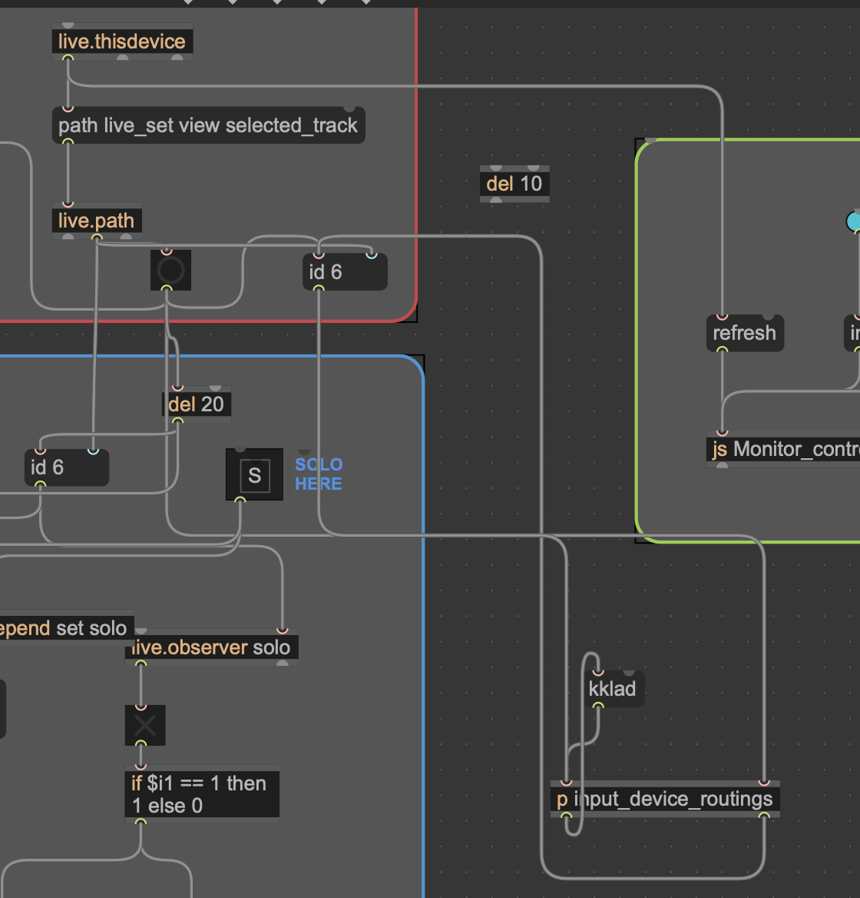
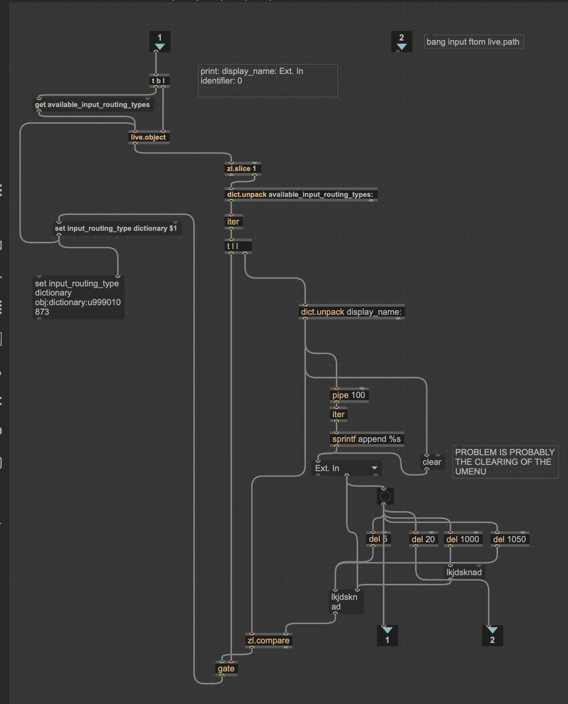

- Potential Control options -
  title:: Control Options
-
- | CV - Face/Head| Speech |
  |------|------|
  | Track to Track Jumping    | Track Name Call     |
  | Smooth Knob and Slider Control  | Knob/Slider Call and Latch |
  | Clip Trigger | Solo and Mute |
  | Clip select down/up | Monitor In/Off/Auto  |
  |  |  |
-
- ## Audio Input Selection
- {:height 286, :width 248}
- This random message cannnot be sent because this will messup the list that dict is unpacking. But the dict unpack has already unpacked the list and has given me the list. in that case all i have to do is to select the input that i want and then send it over back for comparison. So naturally, it requires a retriggering of the id number. And that is actually happening after del 20 from the second output of the input device routing object.
- {:height 421, :width 267}
- Chronologically what is happening?
	- You get the list of inputs as soon as you select a track.
	- You then select an input from the umenu. This triggers a sequence of things that start happening.
	- An instant bang is set out to replace the id number with a placeholder character that doesnt really do anything , in order to reset the first input of the input routing device. This is required because once you have sent the id of the track (initially when you selected the track), it doesnt re select it on retriggering the id number.
	- a message box is instantly filled with the input that you have selected form the umenu. This is then triggered with a delay of 5 ms and sent to zl.compare. (wondering if the track id should be retriggered with a delay of 5 ms as welll) because right now it is being retriggered at a delay of 20 ms.
	  
	  After the id and the input message box are retriggered, it actually does it's job and sends out the appropriate input that we have chosen.
	  6) naturallly, when we have retriggerd the the track id , it should also refill the umenu properlly (AND THIS IS NOT HAPPENING PROPERLY!!!!).
	  NOTE:- it appears that there is some issue in clearing the listt from the previously filled umenu object. It sometimes clears wonderfully and sometimes it doesnt clear and that fucks up the whole thing.
	- Now after the process of choosing the correct input is done, we need to reset the whole thing in case we want to choose another input. For this we have to send another random place holder message that can reset the whole process. But this place holder message only goes to zl.compare to reset the zl.compare for another input choice.
	- No we see that this whole sequence of events is only triggered when we select an appropriate input that we want from the umenu. So we ddont have to worry about the umenu being filled up from every id input.